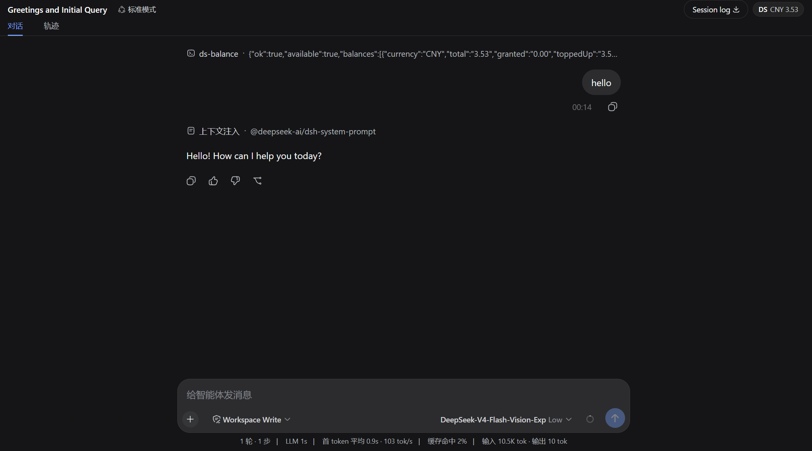

# ds-balance

**[简体中文](README.zh.md) | English**

A minimal **DeepSeek account balance widget** for the [DeepSeek Harness](https://github.com/deepseek-ai/deepseek-harness) (`dsh`) web GUI. A compact pill in the session header shows your current DeepSeek account balance, auto-refreshes, and updates on click.



## Features

- **Live balance pill** in the session header (right side): shows currency and total balance, e.g. `DS CNY 3.65`.
- **Auto-refresh** every 60 seconds; **click** to refresh immediately.
- **Hover for details** — total / granted / topped-up breakdown, multi-currency aware.
- **Secret-safe** — reads `DEEPSEEK_API_KEY` from the DSH credential seam (`~/.dsh/.credentials.yaml` or the environment). The key travels only in the subprocess environment, never in the command line, source, or browser.
- **Read-only & idempotent** — a single HTTPS GET to the balance endpoint.

## Install

```bash
dsh plugin --profile web add github:JovanHE/ds-balance
```

Or from a local checkout:

```bash
dsh plugin --profile web add /path/to/ds-balance
```

Restart `dsh web` after installing — client plugin discovery only runs at process start.

## Usage

Zero configuration. As long as `DEEPSEEK_API_KEY` is set (in the DSH credential store, a `.env`, or the environment), the widget appears at the right of every session header.

- Click the pill to refresh.
- Hover it to see the full breakdown.
- If the key is missing or the request fails, the pill turns red and shows the reason in its tooltip.

## How it works

```
client (browser)                         host (dsh process)
─────────────────                        ─────────────────
header pill  ── GET /__ds-balance ────>  route handler
   │                                             │
   └── parse JSON  <────── JSON ────────────────┘
                                              resolve DEEPSEEK_API_KEY (ctx.get("credentials"))
                                              GET https://api.deepseek.com/user/balance
                                              (ctx.shell / pwsh Invoke-RestMethod)
```

- **Host half** (`lib/index.js`) resolves the key via `ctx.get("credentials")`, then calls the DeepSeek balance endpoint through `ctx.shell` — the endpoint needs an `Authorization` header that the fetch seam cannot carry, so it runs `Invoke-RestMethod` in a subprocess under an explicit `danger-full-access` policy (the deployment's default confinement has no usable sandbox backend on Windows, and this call only reads). It registers the `/__ds-balance` HTTP route via `ctx.webServer`.
- **Client half** (`lib/client.js`) registers a pill in the `conversation.session.header.utilities` slot and fetches `/__ds-balance` on its own origin, then renders the JSON. A plain same-origin fetch mints **no session events**, so the widget's 60s auto-refresh never pollutes the conversation or session log (dispatching a command would write `command/run` + `command/done` records on every refresh). In a bundle client the `host`/`styles` globals are not available (those are dynamic-plugin builtins), so it injects its stylesheet via `document`.

## Project structure

```
lib/
  index.js          Host half: resolve key → call balance API → register /__ds-balance route
  client.js         Client half: header pill widget (bundle loader contract)
assets/
  widget-screenshot.png   Screenshot of the widget in the GUI
package.json        declares dsh.bundle + dsh.client
cordis.patch.yml    inserts the host plugin row
```

## Requirements

- DeepSeek Harness (`dsh`) web profile
- Node.js ≥ 20
- A configured `DEEPSEEK_API_KEY` credential

## License

[MIT](LICENSE)
